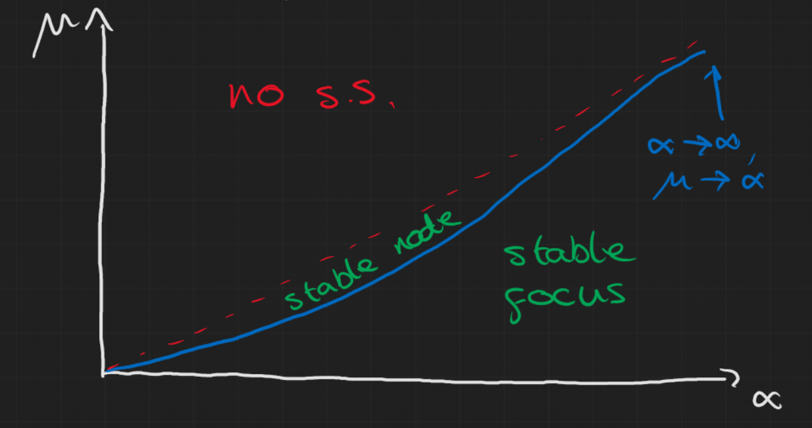
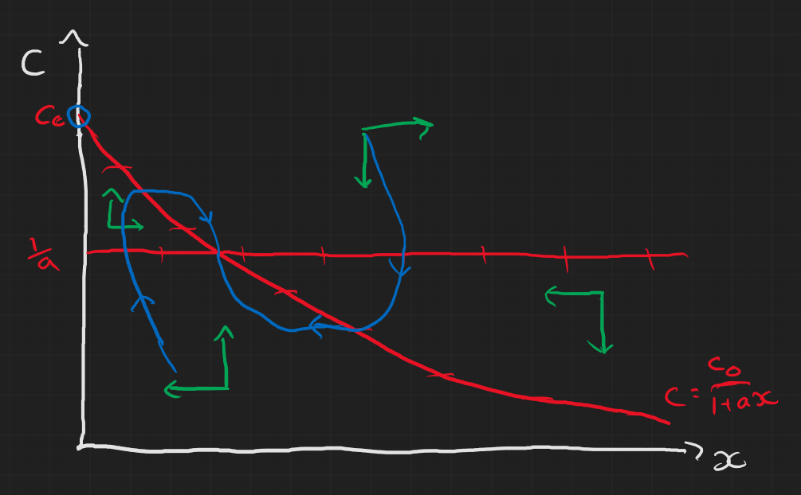
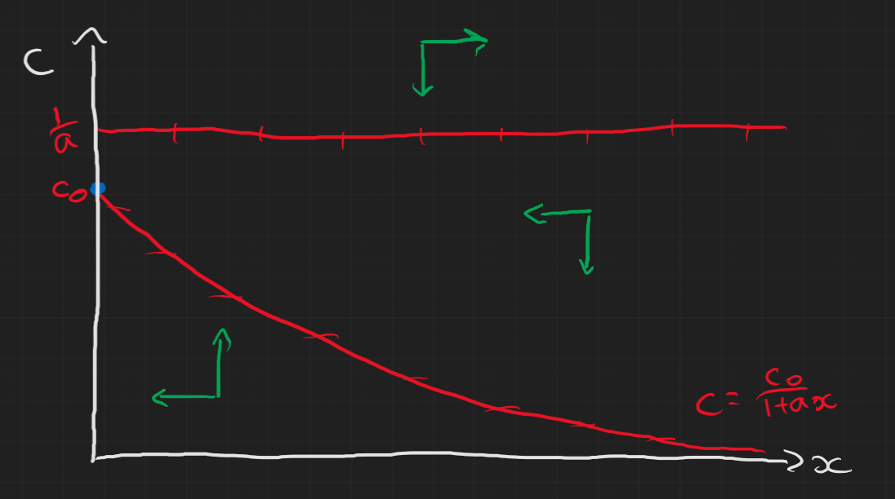
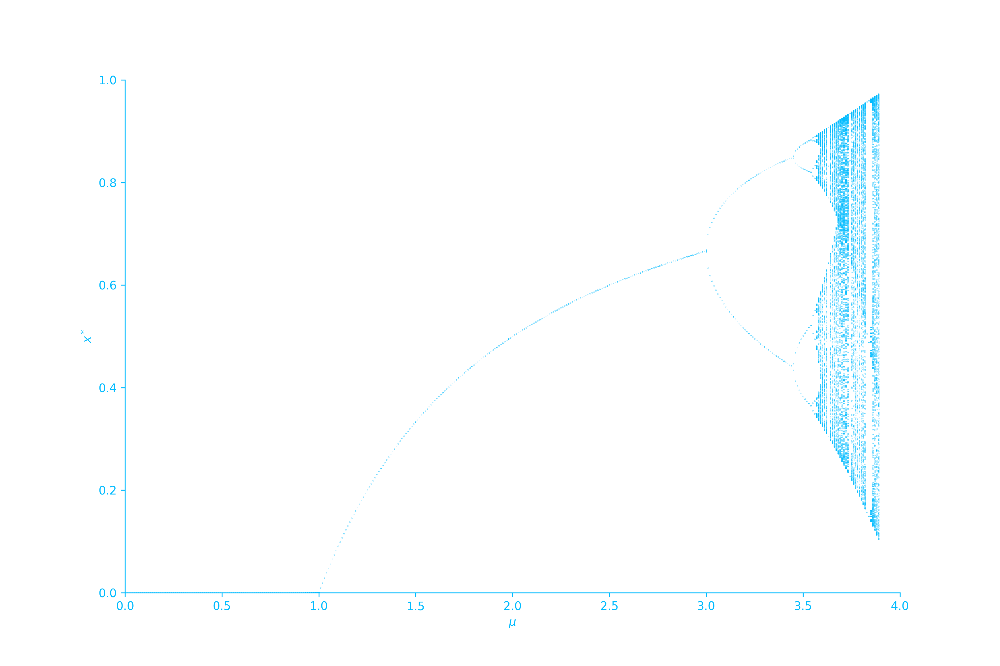

{}

## Comments on Problem sheet A4

It's really important that you remember to check the allowed values for the parameters and state variables! This caused some problems in both questions.

### Question 1 

We were asked to find the condition where it goes from a node to a focus. Recall from [week 4]() we said, for a 2D system with $\dot{\boldsymbol{x}}=A\boldsymbol{x}$ and defining $det(A)=\gamma$ and $tr(A)=\beta$, the eigenvalues are 
$$
\lambda_i = \frac{1}{2}\left(\beta\pm\sqrt{\beta^2-4\gamma}\right).
$$
A focus has complex eigenvalues while a node has real eigenvalues so our boundary where we go from one to the other is
$$
\beta^2=4\gamma.
$$
Which leads us to the condition
$$
\mu=\frac{4\alpha^2}{4\alpha+1}.
$$
However, remember that $x>0,y>0$ always so the steady state $(x^\*,y^\*)=(\frac{\mu}{\alpha},1-\frac{\mu}{\alpha})$ only exists when $\frac{\mu}{\alpha}<1$ and $\mu>0,\alpha>0$ so you need to be careful with the diagram.

### Question 3

This question was mainly testing the idea of nullclines so the general approach was to first set
$$
\begin{aligned}
\frac{dx}{dt} & = 0 \Rightarrow x=0 \text{ or } c=\frac{1}{a} \\\\
\frac{dc}{dt} & = 0 \Rightarrow c=\frac{c_0}{1+ax} 
\end{aligned}
$$
which gives us the nullclines in each direction. The steady states are thus where these lines cross:
$$
(x^\*,c^\*) = (0,c_0) \text{ or } (c_0-\frac{1}{a},\frac{1}{a}).
$$

{}
But the second steady state only exists if $c_0>\frac{1}{a}$ because $x>0$.
{}

Then we can look at the stability of these steady states by finding the Jacobian and evaluating it at the steady states for the two cases
- i) $1<ac_0$: we find that $(0,c_0)$ is an unstable saddle node and $(c_0-\frac{1}{a},\frac{1}{a})$ is a stable node (can just check Routh-Hurwitz)
- ii) $1>ac_0$: we find that $(0,c_0)$ is stable and the other does not exist.

Even without looking at the stability we could draw the nullclines and basically answer the question but the stability helps attempt to sketch the trajectories. It's easy to look at the first case and think the non-trivial steady state is a spiral node but it is in fact this weird looking stable node.
- i)

- ii)

## Lecture Content

### First order maps

A first order map (with one parameter $\mu$) can generally be written as 
$$
x_{n+1} = f(x_n;\mu)
$$
{}
We'll use this to model things like populations but notice this applies to other things like Newton's method for finding roots of a function g:
$$
x_{n+1} = x_n - \frac{g(x_n)}{g'(x_n)}
$$
where we essentially are just iteratively getting better approximations of the steady state where $g(x^\*)=0$, which is the root we are trying to find.
{}

Again we have steady states, $x^\*$, where 
$$
f(x^\*;\mu) = x^\*
$$
and we can do linear stability analysis on it like before about the steady state:
$$
\begin{aligned}
x_n & = x^\* + y_n, \quad |y_N|\ll 1 \\\\
\Rightarrow y_{n+1} = f'(x^\*)y_n.
\end{aligned}
$$
To understand this we need to know how linear maps behave.

### Linear Maps
Linear maps look like this:
$$
x_{n+1} = \lambda x_n + \mu
$$
which we can obtain a full solution for (see the main notes for details)
$$
x_n = x_0\lambda^n + \frac{\mu}{1-\lambda}(1-\lambda^n).
$$
Also we can find the steady steady:
$$
\begin{aligned}
x^\* & = \lambda x^\* + \mu \\\\
\Rightarrow x^\* & = \frac{\mu}{1-\lambda}
\end{aligned}
$$
This gives us four types of behaviour:
- $\lambda>1$: $|x_n|\rightarrow\infty$ and $x_n$ is monotonic as $n\rightarrow\infty$
- $\lambda<-1$: $|x_n|\rightarrow\infty$ and $x_n$ oscillates as $n\rightarrow\infty$
- $0<\lambda<1$: $|x_n|\rightarrow x^\*$  and $x_n$ is monotonic  as $n\rightarrow\infty$
- $-1<\lambda<0$: $|x_n|\rightarrow x^\*$ and $x_n$ oscillates as $n\rightarrow\infty$

This behaviour can then be applied to the linearised non-linear maps about the steady states to analyse the stability of the steady states.

### Cobweb Diagrams

The general approach to this geometric method is as follows:
- Start with the line $x_{n+1} = x_n$
- Next, plot the function $x_{n+1} = f(x_n)$
- Starting from the $x_n$ axis at $x_0$, draw {}vertically{} to the point $f(x_0)$
- Draw {}horizontally{} from $f(x_0)$ to $x_1=f(x_0)$ (the $x_{n+1}=x_n$ line).
- Then draw a line {}vertically{} from there to $f(x_1)$.
- Continue this until you reach a steady state or it appears to go off to infinity.

Below is an illustration for some arbitrary example

### Bifurcations: logistic map

In the lectures you were given an example of the Ricker map, but here I'll mention a similar model called the logistic map. This is defined as 
$$
x_{n+1} = \mu x_n(1-x_n)
$$
This is a really famous example and there's a fantastic [numberphile video]("https://www.youtube.com/watch?v=ETrYE4MdoLQ") on it which I'd encourage you to watch if you're interested and have a go at mapping yourself. Ben Sparks who is in the video is actually part of the University of Bath too!

