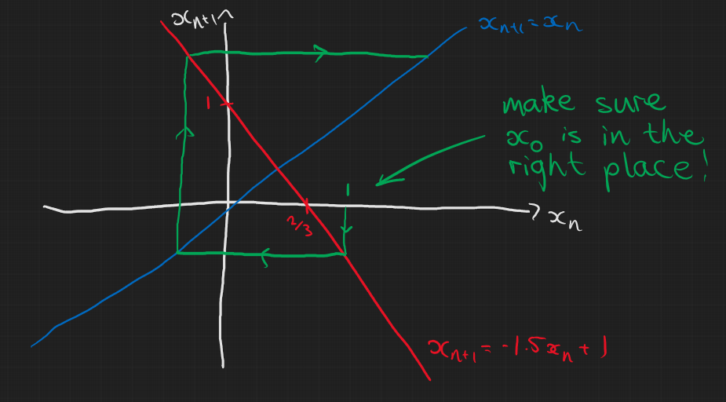
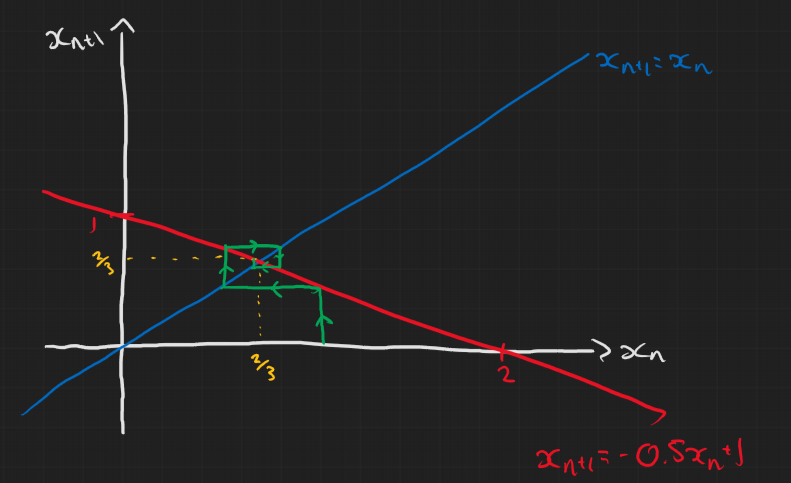
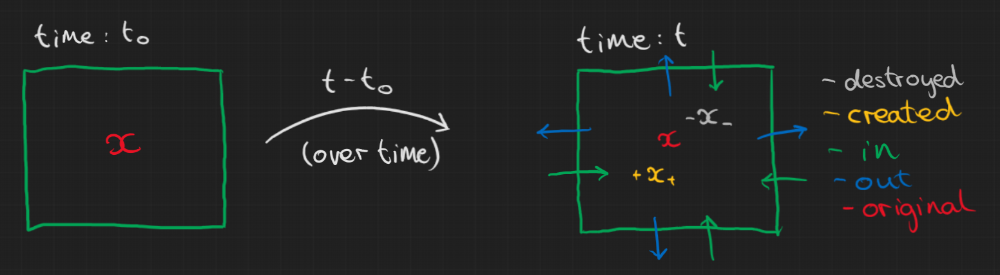

{}

## Comments on Problem sheet A5

### Question 1

For the first two parts, remember that you're drawing a diagram of discrete iterations $n$ so it doesn't really make sense to draw a continuous line. Instead just draw points for each iteration and maybe connect them up.

For parts (d) and (e) in particular, be careful about the initial condition of your 'cobweb'. In all cases $x_0=1$ but I saw many people either not consider where it should be on the line or incorrectly figure out the y and x intercepts. In both cases it didn't change the end result but it is still important and could definitely change the outcome in a nonlinear map. Below are how parts (d) and (e) were meant to look.

### Question 3

#### a) 

$$
x^\* = \frac{rx^\*}{1+x^\*}
$$
$$
\Rightarrow x^\*=0,\quad \text{or } \quad x^\*=r-1
$$

{}
Don't forget to point out that the second steady state only exists if $r>1$ otherwise it would suggest $x<0$ which is unphysical for a population model.
{}

#### b)

Mostly fine but just remember to state what the stability of the steady states are.

#### c)

Some of you were uncertain on how to do the final part of this question. There were two ways to do this, the lazy way (total valid) and the hard way (without using results from the notes).

Either way we start with
$$
\begin{aligned}
y_n & = \frac{1}{x_n} \\\\
\Rightarrow \frac{1}{y_{n+1}} & = \frac{r/y_n}{(y_n+1)/y_n} \\\\
& = \frac{r}{y_n+1} \\\\
\Rightarrow y_{n+1} & = \frac{1}{r}y_n + \frac{1}{r}.
\end{aligned}
$$
So at this point we could just peak at the notes and remember that, for a linear map of the form $x_{n+1} = \lambda x_n + \mu$, the general solution is
$$
x_n = x_0 \lambda^n + \frac{\mu}{1-\lambda}(1-\lambda^n).
$$
Realising that we have a linear map in $y_n$ we can plugging in what we have we'd get 
$$
\begin{aligned}
y_n &  = y_0\frac{1}{r^n} + \frac{1/r}{1-1/r}\left(1-\frac{1}{r^n}\right) \\\\
\Rightarrow y_n & = \frac{y_0(r-1)+r^n-1}{r^n(r-1)} \\\\
\Rightarrow x_n & = \frac{r^n(r-1)}{\frac{1}{x_0}(r-1)+r^n-1} \\\\
\end{aligned}
$$
If we didn't want to copy the result from the lectures we could find it ourself and do it the hard way. I won't put that in here (because I can't be bothered to type it out) but it's in the solutions to the problem sheets, it's in the tutorial whiteboard notes at the top of this page and it's very similar to what is in the lecture notes.

## Lecture Content

### The book keeping method

In general, for a system we can keep track of the amount of stuff over time. We basically say that the total change of stuff in a region is:
- $+$ stuff created
- $-$ stuff destroyed
- $+$ stuff in
- $-$ stuff out

Here's my attempt to summarise this in a diagram. We have some quantity $x$ in a box $R$ at time $t_0$ then the second box is the stuff in the box at time $t$.

## Problem sheet B1

### Question 1

We assume no radioactive nuclei are created (and that no particles enter or leave the system). So the only way the number of particles can change is from nuclear decay:
$$
N(t) = N(t_0) - \text{number of particles decayed}.
$$
We are told the number of disintegrations is proportional to the total number of particles. Thus,
$$
\Rightarrow N(t) = N(t_0) - \lambda \int_0^t N(s)\mathrm{d}s.
$$
Using the fundamental theorem of calculus we can differentiate and get 
$$
\begin{aligned}
\frac{\mathrm{d}N}{\mathrm{d}t} & = \lambda N \\\\
\Rightarrow N(t) & = N(t_0)e^{-\lambda t}.
\end{aligned}
$$

{}We know that{}:
- Rate is 22 decays per min at $t_0$
- Rate is 8.5 decays per min at $t_F$

Also we can find $\lambda$ by using the half-life, $\tau=22.3$ years:
$$
\Rightarrow \frac{1}{2} = e^{-\tau\lambda} \Rightarrow \lambda=\frac{\ln(2)}{\tau}.
$$
{}
This is quite a useful relationship to remember by the way.
$$\lambda=\frac{\ln(2)}{\tau}$$
{}

{}We want to know{} $t_F-t_0$ so let's look at the ratio of the decay rates at these two times
$$
\begin{aligned}
\frac{\lambda N(t_F)}{\lambda N(t_0)} & = e^{-\lambda(t_F-t_0)} = \frac{8.5}{22} \\\\
\Rightarrow \lambda(t_F-t_0) & = \ln\left(\frac{22}{8.5}\right) \\\\
\Rightarrow t_F-t_0 & = \frac{\tau}{\ln(2)}\ln\left(\frac{22}{8.5}\right) \approx 30.59\\\\
\end{aligned}
$$
The final time $t_F$ was 1967AD so $t_0\approx$1936AD so it could be an early Vermeer.

### Question 4

#### a)

We know that enerrgy is conserved so the thermal energy the ice has at $t$ is what it started with at $t_0$ plus the amount of energy used to change the mass of ice from $m(t_0)$ to $m(t)$.
$$
\begin{aligned}
Q(t) & = Q(t_0) + L(m(t_0)-m(t)) \\\\
\Rightarrow \frac{\mathrm{d}Q}{\mathrm{d}t} & = - L \frac{\mathrm{d}m}{\mathrm{d}t}
\end{aligned}
$$

#### b)

Thermal energy of ice at time $t$ = thermal energy of ice at time $t_0$ + energy absorbed in that time. Newton's Law of cooling says that the rate of absorption of energy is proportional to the area of the body and the difference between their temperatures.
$$
\begin{aligned}
\Rightarrow Q(t) & = Q(t_0) + \int_{t_0}^t KA(t)(\theta_1-\theta_0)\mathrm{d}s \\\\
\Rightarrow \frac{\mathrm{d}Q}{\mathrm{d}t} & = KA(t)(\theta_1-\theta_0) \\\\
\end{aligned}
$$

#### c)

Equate the two relationships for the rate of change of thermal energy so that 
$$
L\frac{\mathrm{d}m}{\mathrm{d}t} = KA(t)(\theta_1-\theta_0)
$$
Now for a sphere with radius $r$:
- volume: V = $\frac{4}{3}\pi r^3$
- surface area: A = $4\pi r^2$
So the total mass at time $t$ is
$$
m(t) = \frac{4}{3}\pi\rho r^3(t)
$$
where $\rho$ is the density. Therefore,
$$
\begin{aligned}
\frac{\mathrm{d}m}{\mathrm{d}t} & = 4\pi\rho r^2(t) \frac{\mathrm{d}r}{\mathrm{d}t} \\\\
\Rightarrow 4\pi L \rho r^2 \frac{\mathrm{d}r}{\mathrm{d}t} & = 4\pi r^2 K(\theta_1-\theta_0) \\\\
\frac{\mathrm{d}r}{\mathrm{d}t} & = \frac{K}{L\rho}(\theta_0-\theta_1) \\\\
\Rightarrow r(t) & = \frac{K}{L\rho}(\theta_0-\theta_1)t + r_0
\end{aligned}
$$
We finally have an equation for the radius at time $t$ for the ball of ice and the time, $T$, at which it has completely melted should be when $r(T)=0$
$$
\Rightarrow T = \frac{r_0L\rho}{K(\theta_1-\theta_0)}.
$$